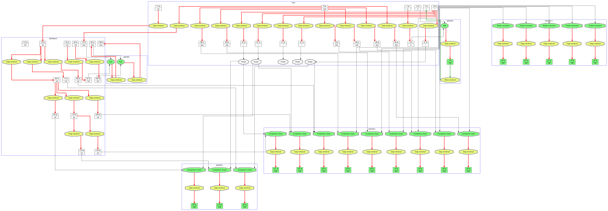
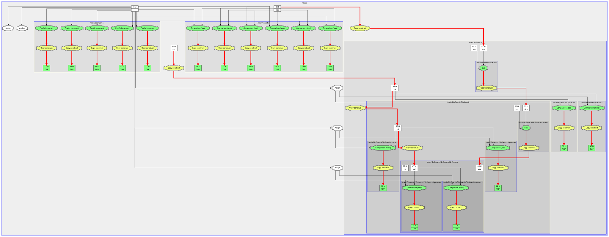
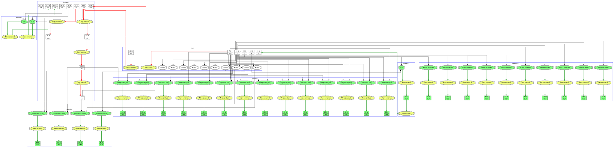
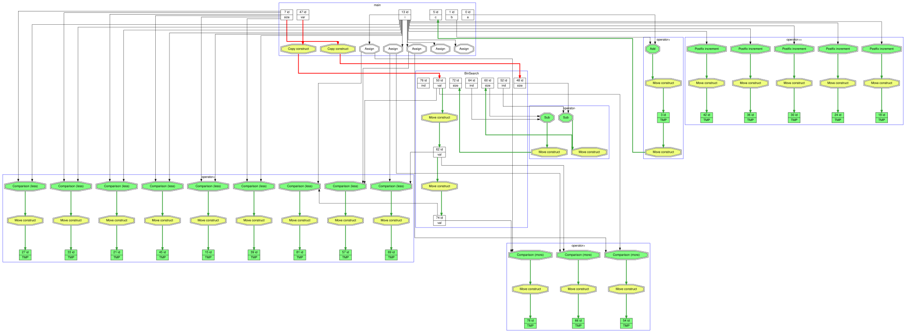
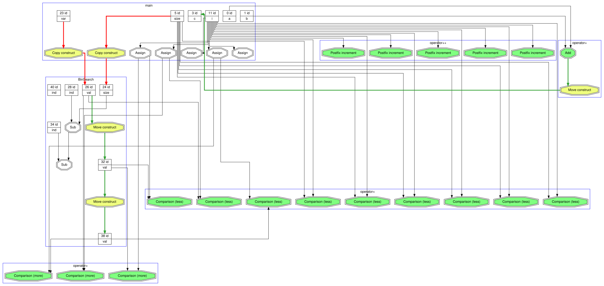

# Microscope

Цель проекта заключалась в определении мест, где происходит излишнее копирование, а так же в замене их на перемещение.

## Исследование

### Рассмотренный пример и инструмент для *слежки* за переменными

Исследование производилось на примере простой программы - **Бинарного поиска**, код которого указан ниже

<details>
<summary> Бинарный поиск </summary>

``` C++
#include "microscope.hpp"

int BinSearch(Micro<int>* arr, Micro<int> val, Micro<int> len);

int main() {
    SetLogLevel(kDebug);

    MICRO(int, size, 5);
    Micro<int> arr[5] = {};

    for (MICRO(int, i,0); i < size; i++) {
        MICRO_UPDATENAME(arr[i]);
        arr[i] = i;
    }

    MICRO(int, var, 4);
    fprintf(stdout, "Found index is %d\n", BinSearch(arr, var, size));

    Micro<int>::graph_builder.Draw();
}

int BinSearch(Micro<int>* arr, Micro<int> val, Micro<int> size) {
    MICRO_UPDATENAME(val);
    MICRO_UPDATENAME(size);
    MICRO(int, ind, size / 2);

    if ((size == 1) && (val != arr[ind])) {
        return -1;
    }

    if (arr[ind] > val) {
        return BinSearch(arr, val, ind);
    }

    if (arr[ind] < val) {
        return BinSearch(arr + ind, val, size - ind) + ind;
    }

    return ind;
}
```
</details>

Шаблонный класс описан в файле [microscope.hpp](microscope.hpp). Для работы с ним существуют два макроса:

``` C++
#define MICRO(type, var, val) Micro<type> var(val, #var, __FUNCTION__)
#define MICRO_UPDATENAME(var) var.UpdateNameAndFuncName(#var, __FUNCTION__)
```

Первый отвечает за создание и инициализацию переменной. Пример:

``` C++
MICRO(int, a, 0);
```

Второй - за обновление имён параметров функции и информации об имени этой функции. Пример:

``` C++
void foo(Micro<int> a) {
    MICRO_UPDATENAME(a);
    ...
}
```

## Этапы оптимизации

### Только копирование

Было оставлено только копирование. Move-конструктора не было, все параметры передавались по значению. Результат изучения поведения переменных был таков:



На изображении красными стрелками обозначены конструкторы копирования, а черными стрелками - использование переменных в различных операциях. Белые вершины - переменные, зелёные вершины - временные переменные, жёлтые вершины - обозначения для конструкторов.

Наща задача - уменьшить количество красных стрелок.

### LValue

На данном этапе были добавлены lvalue ссылки, так что параметры стали передаваться в методы и операторы по ссылкам, что заметно уменьшило количество копирований.
начению. Результат изучения поведения переменных был таков:



### Move-конструктор

Теперь стал доступен конструктор перемещения (move-конструктор). Благодаря нему часть красных стрелок перекрасилась в зелёный цвет, означающий вызов этого конструктора.



### std::move

На прошлом графе можно заметить многократное копирование внутри вызова функции бинарного поиска, что означает, что внутри неё параметры передаются по значению, так что я добавил в её вызов `std::move` для рекурсивной передачи с помощью конструктора перемещения, а не копирования.

<details>
<summary> Новый вид функции </summary>

``` C++
int BinSearch(Micro<int>* arr, Micro<int> val, Micro<int> size) {
    MICRO_UPDATENAME(val);
    MICRO_UPDATENAME(size);
    MICRO(int, ind, size / 2);

    if ((size == 1) && (val != arr[ind])) {
        return -1;
    }

    if (arr[ind] > val) {
        return BinSearch(arr, std::move(val), std::move(ind));
    }

    if (arr[ind] < val) {
        return BinSearch(arr + ind, std::move(val), size - ind) + ind;
    }

    return ind;
}
```

</details>



### Copy Elision

На данном этапе я включил компиляторную оптимизацию **Copy Elision** с помощью флага `-fno-elide-constructors`. Данная оптимизация убрала создание лишних переменных и добавила конструирование объектов с помощью перемещения в большинстве оставшихся мест.



## Вывод

Таким образом, благодаря **lvalue** и **rvalue** ссылкам, а так же оптимизации компилятора удалось избежать почти всех копирований, за исключением самых первых - передачи параметров в функцию.
